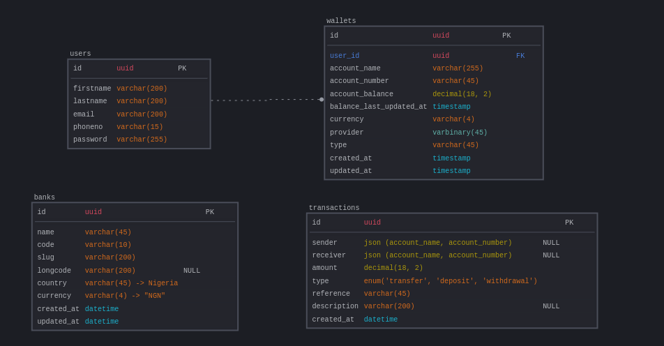

# lendsqr WalletService

## Overview
lendsqr Demo WalletService is a robust API for managing user wallets, allowing users to create wallets, perform transactions, and check balances securely.

## Features
- User authentication
- Wallet creation and management
- Deposit, withdrawal, and transfer transactions
- Transaction history tracking
- Secure JWT-based authentication

## Tech Stack
- **Backend:** Node.js, Express, TypeScript
- **ORM:** KnexJS
- **Database:** MySQL
- **Authentication:** JWT
- **Test:** Jest

## Installation

```sh
# Clone the repository
git clone https://github.com/Elijah57/lendsqr.git

# Navigate to the project folder
cd lendsqr

# Install dependencies
npm install

# Set up environment variables
cp .env.example .env

# Start the server
npm run dev
```


# 🏦 Wallet Service Documentation

## 📖 Overview
The **Wallet Service** manages user transactions, balances, and financial operations within our application. This document outlines the **ER Diagram** and core functionalities of the wallet service.

## 📌 Entity-Relationship Diagram (ERD)
The **ER Diagram** visually represents the relationships between key database entities in the wallet system.

  


### **🗂️ Entities & Relationships**
1. **Users** 👤  
   - `id` (PK) – Unique identifier for each user.  
   - `firstname` – User's first name.  
   - `lastname` – User's last name.  
   - `phoneno` – User's phone number.  
   - `email` – Unique email address.  
   - `password` – Hashed password for authentication.  
   - `created_at` – Timestamp when the user was created.  
   - `updated_at` – Timestamp when the user was updated.  

2. **Wallets** 💰  
   - `id` (PK) – Unique identifier for each wallet.  
   - `user_id` (FK) – References the user owning the wallet.  
   - `account_balance` – Current wallet balance.  
   - `account_number` – Unique identifies for each wallet, to facilitate transactions.  
   - `account_name` – Full name of the user owning the wallet.  
   - `currency` – Type of currency (defaults to NGN).  
   - `provider` – Provider of the wallet service account (defaults to lendsqr-demo).  
   - `balance_last_updated` – Timestamp when the wallet balance was updated.  
   - `type` – Wallet type (defaults to `default`).  
   - `created_at` – Timestamp when the wallet was created.  

3. **Transactions** 🔄  
   - `id` (PK) – Unique transaction ID.  
   - `sender` – References the wallet {`account_name`, `account_number`}involved.  
   - `receiver` – References the wallet {`account_name`, `account_number`}involved.  
   - `type` – Transaction type (`deposit`, `withdrawal`, `transfer`).  
   - `amount` – Transaction amount.  
   - `status` – Transaction status (`pending`, `completed`, `failed`).  
   - `reference` – Unique transaction reference code.  
   - `created_at` – Timestamp of the transaction.  

4. **Banks** 💳  - Banks in nigeria and their information

 	- `id` (PK) – Unique record identifier.  
	- `name` – Name of the entity.  
	- `code` – Unique short identifier.  
	- `slug` – URL-friendly unique identifier.  
	- `longcode` – Optional long version of the `code`.  
	- `country` – Country of the entity (default: `Nigeria`).  
	- `currency` – Currency used (default: `NGN`).  
	- `created_at` – Timestamp when the record was created.  
	- `updated_at` – Timestamp when the record was last updated.  


## API Endpoints

### Authentication

#### 1. User Registration
**Endpoint:** `POST /api/v1/auth/signup` 

**Description:** This endpoint facilitate users account creation, on signup, user account is created and a wallet is automatically created for each user
**Request Body:**
```json
{
  "firstname": "John",
  "lastname": "Doe",
  "email": "johndoe@example.com",
  "phoneno": "+2345683954895",
  "password": "securepassword"
}
```
**Response:**
```json
{
	"status": true,
  "message": "User registered successfully",
	"userDetails": {
		"user": {
			"id": "426f4ee7-030e-11f0-94a9-0242ac150002",
			"firstname": "Chris",
			"lastname": "Dicki"
		},
		"walletId": {
			"id": "42706d22-030e-11f0-94a9-0242ac150002",
			"account_name": "Chris Dicki",
			"account_number": "2338726228",
			"account_balance": "0.00"
		}
  }
}
```

#### 2. User Login
**Endpoint:** `POST /api/v1/auth/login`

**Description** This endpoint facilitate login into the wallet service, on successful login, a request cookie containing `accessToken` and `refreshToken` is sent
**Request Body:**
```json
{
  "email": "johndoe@example.com",
  "password": "securepassword"
}
```
**Response:**
```json
{
 
	"message": "Login successful"
}
```

### Wallet Operations

#### 3. Get Wallet Details
**Endpoint:** `GET /api/v1/wallet`

**Description:** This endpoint returns the authenticated user's wallet details
**Headers:**
```json
{
  "Authorization": "Bearer JWT_ACCESS_TOKEN"
}
```
**Response:**
```json
{
	"status": true,
	"wallet": {
		"id": "fcf38e18-02b2-11f0-81d5-0242ac150004",
		"user_id": "fcf2ad2d-02b2-11f0-81d5-0242ac150004",
		"account_name": "Charles Adams",
		"account_number": "8545331657",
		"account_balance": "6374000.00",
		"currency": "NGN",
		"provider": "lendsqr-demo",
		"type": "default",
		"balance_last_updated": "2025-03-17T12:44:37.000Z",
		"created_at": "2025-03-16T21:07:01.000Z",
		"updated_at": "2025-03-16T21:07:01.000Z"
	}
}
```

#### 4. Deposit Funds
**Endpoint:** `POST /api/v1/wallet/fund`

**Description:** This endpoint facilitate top-up of a users account. it respond with a paystack checkout link and reference to fund their account

**Headers:**
```json
{
  "Authorization": "Bearer JWT_ACCESS_TOKEN"
}
```

**Request Body:**
```json
{
	"amount": 20000
}
```
**Response:**
```json
{
	"message": "Payment Initialized successfully",
	"data": {
		"authorization_url": "https://checkout.paystack.com/uk75qiw8qwbipui",
		"access_code": "uk75qiw8qwbipui",
		"reference": "a0fo93hbu8"
	}
}
```

#### 5. Verify Funds Deposit
**Endpoint:** `POST /api/v1/wallet/verify-payment`

**Description:** After a transaction (fund-account) is made, paystack call this url, returning the status of the transaction. if transaction status is success, it updates the user account and return new balance.

**Headers:**
```json
{
  "Authorization": "Bearer JWT_ACCESS_TOKEN"
}
```

**Request Body:**
```json
{

}
```
**Response:**
```json
{
  "message": "Payment Verified, Account credited",
  "updatedData": {
    "userId": "fcf2ad2d-02b2-11f0-81d5-0242ac150004",
    "firstname": "Charles",
    "lastname": "Adams",
    "email": "elijahechekwu30@gmail.com",
    "walletId": "fcf38e18-02b2-11f0-81d5-0242ac150004",
    "account_balance": "8374000.00",
    "account_number": "8545331657",
    "account_name": "Charles Adams",
    "balance_last_updated": "2025-03-17T13:05:25.000Z"
  }
}
```


#### 6. Withdraw Funds
**Endpoint:** `POST /api/wallet/withdraw`

**Description:**: This endpoint facilitates withdrawal, into an external account, from the provider (lendsqr-demo). At this moment, it does that, but the actual implementation is commented out, because a live paystack account, with cash would be needed to implement this. It currently returns, the account name, and number associated with that external account.

**Headers:**
```json
{
  "Authorization": "Bearer JWT_ACCESS_TOKEN"
}
```

**Request Body:**
```json
{
	"amount": 500,
	"account_number": "0824592156",
	"bank_name": "Access Bank",
	"description": "Testing withdrawal"
}
```
**Response:**
```json
{
	"status": true,
	"data": {
		"transaction": {
			"sender": {
				"account_name": "Charles Adams",
				"account_number": "8545331657"
			},
			"receiver": {
				"account_name": "CHIBUZOR ELIJAH ECHEKWU",
				"account_number": "0824592156"
			},
			"amount": "500.00",
			"reference": "TXN-25031835806868532120",
			"description": "Testing withdrawal"
		},
		"balance": "8372500.00"
	}
}
```

#### 7. Transfer Funds
**Endpoint:** `POST /api/v1/wallet/transfer-to`

**Description:** This endpoint facilitates transfering of money, within accounts in the providing platform (lendsqr-demo)

**Headers:**
```json
{
  "Authorization": "Bearer JWT_ACCESS_TOKEN"
}
```

**Request Body:**
```json
{
	"receiver": "8510179997", // lendsqr-demo account number
	"amount": 2000,
	"description": "Send some money test"
}
```
**Response:**
```json
{
	"status": true,
  "message": "money sent",
	"data": {
		"sender": {
			"account_name": "Charles Adams",
			"account_number": "8545331657"
		},
		"receiver": {
			"account_name": "Aiden Mohr",
			"account_number": "8510179997"
		},
		"amount": "2000.00",
		"reference": "TXN-25031742501925503132",
		"description": "Send some money test"
	}
}
```


#### 8. Bank Resolve
**Endpoint:** `POST /api/v1/wallet/bank-resolve`
**Description:** This endpoint resolves/verify the account details associated with a bank and account number. this is a utility function, that verifies account number before withdrawals

**Request Body:**
```json
{
	"account_number": "0824592156",
	"bank_name": "Access Bank"
}
```
**Response:**
```json
{
	"message": "Account number resolved",
	"data": {
		"account_number": "0824592156",
		"account_name": "CHIBUZOR ELIJAH ECHEKWU",
		"bank_id": 1
	}
}
```

### Transactions
#### 8. Get Transaction History
**Endpoint:** `GET /api/v1/wallet/transactions`

**Description:** This endpoint returns the transaction history of the authenticated user

**Headers:**
```json
{
  "Authorization": "Bearer JWT_ACCESS_TOKEN"
}
```

**Response:**
```json
{
	"status": true,
	"wallet": [
		{
			"id": "41f6bf58-030a-11f0-94a9-0242ac150002",
			"sender": {
				"account_name": "Charles Adams",
				"account_number": "8545331657"
			},
			"receiver": {
				"account_name": "Aiden Mohr",
				"account_number": "8510179997"
			},
			"amount": "2000.00",
			"type": "transfer",
			"reference": "TXN-TXN-25031732412797280535",
			"description": "Send some money test",
			"created_at": "2025-03-17T07:31:43.000Z"
		},
		{
			"id": "a4b2b7a7-02b4-11f0-81d5-0242ac150004",
			"sender": {
				"account_name": "Charles Adams",
				"account_number": "8545331657"
			},
			"receiver": {
				"account_name": "Aiden Mohr",
				"account_number": "8510179997"
			},
			"amount": "6000.00",
			"type": "transfer",
			"reference": "TXN-25031635534884192259",
			"description": "Send some money test",
			"created_at": "2025-03-16T21:18:52.000Z"
		},
		{
			"id": "ed24e6b4-0309-11f0-94a9-0242ac150002",
			"sender": {
				"account_name": "Charles Adams",
				"account_number": "8545331657"
			},
			"receiver": {
				"account_name": "Aiden Mohr",
				"account_number": "8510179997"
			},
			"amount": "2000.00",
			"type": "transfer",
			"reference": "TXN-25031710840449191333",
			"description": "Send some money test",
			"created_at": "2025-03-17T07:29:21.000Z"
		},

	]
}
```

## Error Handling
- `400 Bad Request` - Invalid input
- `401 Unauthorized` - Invalid or missing authentication token
- `403 Forbidden` - Action not allowed
- `404 Not Found` - Resource not found
- `500 Internal Server Error` - Server-side issue


---

# **📚 Libraries Used & Their Purpose**  

This document provides an overview of the dependencies used in this project, explaining their roles and why they were chosen.  

## **🔐 Security & Authentication**  

- **`argon2`** (`argon2id`) –  The OWASP (Open Web Application Security Project) Recommends using `argon2id` as best practices for securely hashing passwords using the Argon2 algorithm. It is Used for **password hashing**. Argon2 is a modern, secure, and memory-hard hashing algorithm that protects passwords against brute-force attacks.  

- **`jsonwebtoken`** (`jwt`) – Used for **authentication** via JWT (JSON Web Tokens). It enables secure token-based authentication for user sessions.  

## **🌐 Server & API Handling**  

- **`express`**  – A lightweight and powerful web framework for Node.js. It simplifies API development by handling routes, middleware, and request-response logic.  

- **`cors`** – Middleware that enables **Cross-Origin Resource Sharing (CORS)**, allowing the server to handle requests from different origins (e.g., frontend apps hosted separately).  Cors options for this project can be found in `src/configs`. At the momnet, it accepts request from all origins `*`, but could be configure.

- **`node-fetch`** – A lightweight module for making **HTTP requests** from the server. It is used in this project to fetch external APIs (paystack, adjutor).  


## **🗄️ Database & Query Handling**  

- **`knex`**  – A SQL query builder that provides a structured way to interact with databases, supporting **migrations, transactions, and connection pooling**.  The configurations can be found in the `knexfile.ts`
- **`mysql2`**  – A high-performance MySQL driver for Node.js, used by **Knex.js** to connect and execute queries efficiently.  

## **🔧 Environment Configuration**  

- **`dotenv`** (`^16.4.7`) – Loads **environment variables** from a `.env` file, keeping sensitive data like database credentials and API keys secure.  

## **🛢️ Database Setup**  

- **Database Engine:**  
  - The project uses **MySQL 8.0 (Oracle)** as the database engine, running inside a **Docker container**.  
  - **Image:** `mysql:8.0-oracle`  
  - **Storage:** A **persistent volume** is used to ensure data is not lost when the container stops or restarts.  

- **Adminer UI:**  
  - **Adminer** is included in the Docker setup as a lightweight web-based database management tool.  
  - It allows developers to interact with the database via a **simple web interface** instead of running raw SQL queries manually.  

---


## **🛠️ Architectural Design & Folder Structure**  


This project follows a **modular and OOP-based architecture**, ensuring **separation of concerns**, maintainability, and ease of collaboration.
---

## **🏗️ Architectural Design Overview**  
The backend is designed using the **MVC (Model-View-Controller) pattern**, with additional layers for **services, middlewares, utilities, and database interactions**. This ensures:  

✔️ **Separation of concerns** (each module has a single responsibility).  
✔️ **Scalability** (new features can be added without breaking existing logic).  
✔️ **Reusability** (common logic is extracted into reusable services and utilities).  

The system consists of the following core components:  

1. **Controllers** – Handle incoming requests and responses.  
1. **APIs** – Handle request and responses from API services.  
2. **Services** – Contain business logic and communicate with repositories.  
3. **Middlewares** – Handle request validation, authentication.  
4. **Utilities (Utils)** – Reusable helper functions (e.g., hashing, JWT handling, generating Transaction Reference).  
5. **Database (DB Layer)** – Manages migrations, schemas, repositories, and connections.  
6. **Configuration (Configs)** – Centralized application settings (e.g., environment variables, database config).  

---

## **📁 Folder Structure**  

```
/src
├── api             # External API integrations (e.g., Paystack, Adjutor)
│   ├── adjutor.ts         # Adjutor API wrapper
│   ├── baseApi.ts         # Base API class for standardizing API calls
│   └── paystackApi.ts     # Paystack API wrapper
├── app.ts          # Initializes Express app, middleware, and routes
├── configs         # Configuration files
│   └── index.ts          # Centralized app configuration (env, DB, JWT)
├── controllers     # API layer handling HTTP requests
│   ├── auth.ts           # Authentication-related endpoints
│   ├── paystack.ts       # Paystack-related API endpoints
│   └── wallet.ts         # Wallet-related API endpoints
├── db             		# Database logic (Knex.js)
│   ├── index.ts         		# Knex instance & DB connection setup
│   ├── migrations       		# Database migrations (schema updates)
│   │   ├── users.ts            # User table migration
│   │   ├── wallets.ts          # Wallet table migration
│   │   ├── transactions.ts     # Transactions table migration
│   │   └── banks.ts            # Banks table migration
│   ├── repositories.ts  		# Repository pattern for DB queries
│   └── schema           		# Database schema definitions
├── index.ts         	# Main entry point (starts the server)
├── middlewares      	# Middleware functions for requests
│   ├── auth.ts           	# Authentication middleware (JWT, sessions)
│   └── error.ts          	# Global error handler
├── routes          	# API route definitions
│   ├── auth.ts          	# Auth-related routes
│   ├── index.ts          	# Main router aggregating all routes
│   └── wallet.ts         	# Wallet-related routes
├── services       		# Business logic layer (OOP-based)
│   ├── authService.ts    	# Auth-related business logic
│   └── walletService.ts  	# Wallet-related business logic
├── types           	# TypeScript type definitions
│   └── index.d.ts       	# Global type definitions
└── utils          	 	# Helper functions and wrappers
    ├── asyncWrapper.ts   	# Async Request error handling utility
    ├── index.ts          	# Utility index file
    └── serviceWrapper.ts 	# Wrapper for services error handling calls
```
